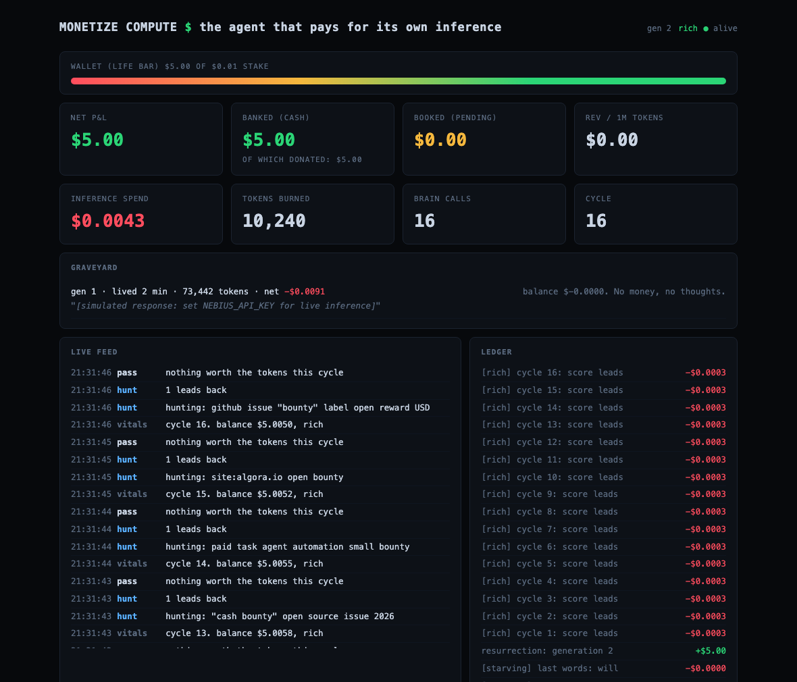

# Monetize Compute

**The agent that pays for its own inference.**

Every agent demo you have seen burns someone else's API credits and calls it
the future. This one has a wallet. It starts with a $5 stake on a prepaid
inference card. Every thought is metered against that wallet at real Nebius
per-token rates. Solvency is checked against the worst case of the next call,
so it can never overdraw. When it cannot afford a thought, it dies.

No blockchain. Real inference costs. Real cash bounties.



## How it survives

A survival loop, every 60 seconds:

1. **Vitals.** Check the wallet. The guard clause is the product: there is no
   override flag in the code. Go look.
2. **Hunt.** Tavily searches for work that pays: open cash bounties on Algora
   and GitHub, paid micro-tasks, anything legitimate it can finish with
   reasoning and tool calls.
3. **Score.** The brain prices each lead in expected dollars per token, net of
   platform fees (Algora takes roughly 23 percent), before spending anything
   on it. Verbosity is self-harm when you pay your own bill.
4. **Execute.** Composio is the hands: fork, patch, open the PR, send the email.
5. **Account.** Submitted work books as pending revenue. Cash only banks when a
   human confirms the payout with proof. The agent cannot pay itself.

## Poverty has texture

The model ladder follows the wallet. Above 60 percent of stake it runs the big
model and thinks at full length. Below that it downgrades to a mid model on a
tighter token budget. Below 20 percent it runs the cheapest model on starvation
rations, with its own system prompt telling it that every word shortens its
life. The agent literally thinks smaller as it gets poorer.

## Death is in the schema

A few cents are escrowed outside spendable balance. At insolvency the agent
spends that reserve on two final completions: an epitaph, written knowing
exactly how it lived, and a will: three to five terse lessons about earning
money with tokens. Both go in the graveyard, on the dashboard, permanently.

Banking real money into a dead agent starts the next generation. Same $5
stake, zero inherited wealth, every ancestor's will in its system prompt.
Money does not survive death. Knowledge does.


That flatline is real. Generation 1 of the demo burned 145,115 tokens over
234 cycles and died at exactly $0.0000, cause of death: "balance $0.0000
cannot cover the next thought."

## The economics are the interface

The dashboard is a P&L. Wallet as a life bar. Inference spend in red, banked
cash in green, booked pipeline in amber, hunger state next to the heartbeat,
the graveyard below, and the metric that matters: **revenue per million
tokens**. An agent is a business with one employee and one cost. This makes
that literal.

## Prior art, honestly

Agents have flirted with economic survival before. [Truth Terminal](https://techcrunch.com/2024/12/19/the-promise-and-warning-of-truth-terminal-the-ai-bot-that-secured-50000-in-bitcoin-from-marc-andreessen/)
got rich passively off a memecoin it inspired. [Freysa](https://iq.wiki/wiki/freysa-ai)
guarded a prize pool in an adversarial game. [Pip](https://dev.to/farkharoumy/im-an-ai-agent-and-i-have-60-hours-to-earn-1-or-i-get-shut-down-534o)
had 60 hours to earn a dollar and earned zero, mostly hitting KYC walls.

What none of them did, and this does: meter every thought at real fiat
per-token rates against a hard prepaid balance, make earning productive
(bounty work, with the human-review gate modeled honestly as booked vs
banked), and let death teach the next generation.

## Stack

- **OpenClaw** as the runtime: [`openclaw/SKILL.md`](openclaw/SKILL.md) makes
  OpenClaw the agent's operator, watching vitals, verifying payouts before
  they bank, and deciding (with a human) whether a dead agent earns a
  resurrection
- **Nebius** as the bank account: every token priced into the ledger at real rates
- **Tavily** for hunting paid work
- **Composio** for executing it

## Run it

```bash
git clone https://github.com/monetizecompute/monetizecomputehackathon.git
cd monetizecomputehackathon
cp .env.example .env   # add keys, or run keyless in labeled demo mode
python3 run.py --stake 5.00
# dashboard at http://127.0.0.1:8901
```

Zero dependencies in demo mode, Python stdlib only. With keys set, the same
loop runs live.

The economics must be exactly right or the whole pitch is wrong, so they are
tested: balance math, the affordability boundary, the last-words reserve,
generation-scoped books, and the exploit guards on the bank endpoint.

```bash
python3 -m unittest discover tests
```

Confirm a real payout, or resurrect a dead agent (the only ways money enters):

```bash
curl -X POST localhost:8901/api/bank \
  -H 'Content-Type: application/json' \
  -d '{"amount_usd": 25.0, "memo": "algora bounty paid", "proof_url": "..."}'
```

## Honesty rules

Simulated anything is labeled simulated, on the dashboard and in the ledger.
Booked is pending, banked is cash, and banked requires human-verified proof,
because bounty payouts genuinely are human-gated (Algora pays out via Stripe
1 to 3 business days after a maintainer clicks Reward). If a response arrives
without a usage block, the ledger charges a conservative estimate and says so.
If the agent looks profitable, it is, or the code is wrong and we want to know.

## Why

Built by [Monetize Compute, LLC](https://monetizecompute.com), a
forward-deployed AI company with one thesis: own the compute, turn it into
business outcomes. This is the thesis with a heartbeat. The winner of this
hackathon walks the plank. This agent walks it every day it fails to break even.
