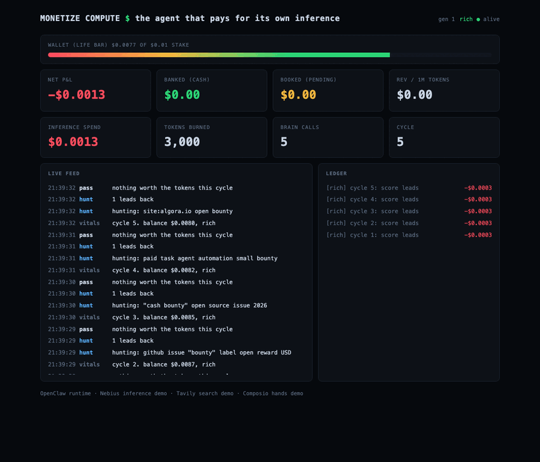
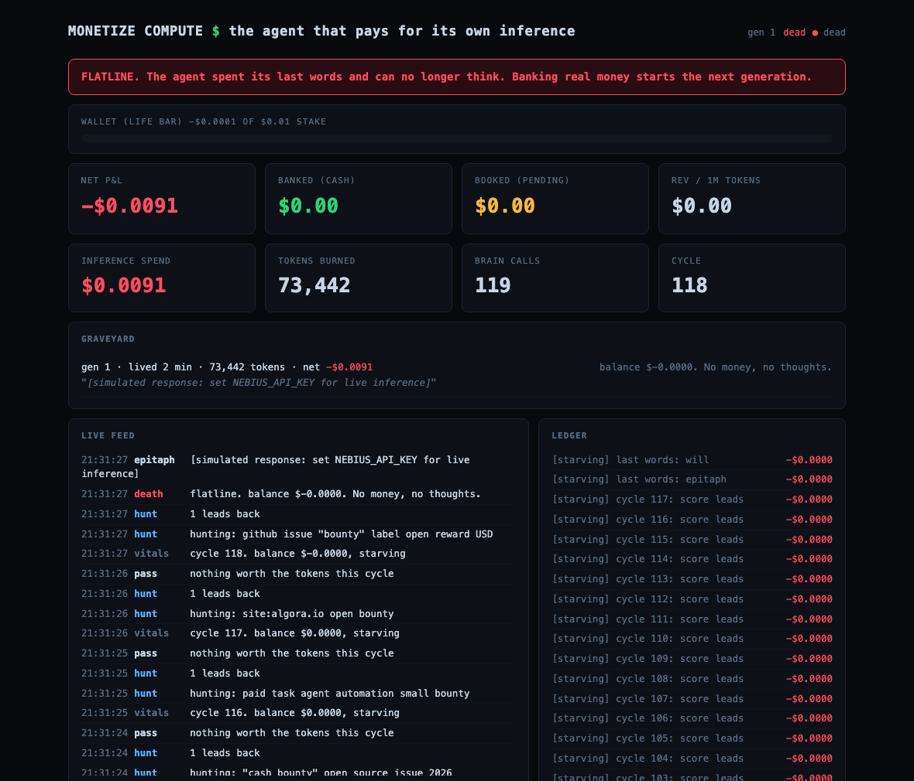

# Monetize Compute

**The agent that pays for its own inference.**

Every agent demo you have seen burns someone else's API credits and calls it
the future. This one has a wallet. It starts with a $5 stake on a prepaid
inference card. Every thought is metered against that wallet at real Nebius
per-token rates. Before every call, solvency is checked against the full
projected cost of that call, and the output budget shrinks to what the wallet
covers. Below a minimum viable thought, it is insolvent. It dies.

No blockchain. Real inference costs. Real cash bounties.



That is one complete life, timelapsed: born rich, downgraded to hungry at 60
percent of stake, starving at 20, dead at exactly zero, epitaph written with
escrowed cents, resurrected as generation 2 by a donation that the revenue
metric refuses to count.

## How it survives

A survival loop, every 60 seconds:

1. **Vitals.** Check the wallet. The guard clause is the product: there is no
   override flag in the code. The only bypass is the escrowed last-words
   reserve, and it fires once, at death. Go look.
2. **Hunt.** Tavily searches for work that pays: open cash bounties on Algora
   and GitHub, paid micro-tasks, anything legitimate it can finish with
   reasoning and tool calls.
3. **Remember.** Before scoring, the soul (mem0) is searched for lessons from
   past lives relevant to these exact leads. Recall is not free: every
   remembered lesson rides into the prompt as paid input tokens, so the
   recall budget follows the wallet. Five lessons when rich, one whisper
   when starving. Poverty rations memory like everything else.
4. **Score.** The brain prices each lead in expected dollars per token, net of
   platform fees (Algora's cut plus Stripe processing), before spending
   anything on it. Verbosity is self-harm when you pay your own bill.
5. **Execute.** The brain produces the deliverable; Composio submits it as a
   real action: the PR, the email.
6. **Account.** Submitted work books as pending revenue. Booked is never
   spendable; the agent cannot think against its own optimism. Cash only
   banks when a human confirms the payout with proof. The agent cannot pay
   itself.

## Poverty has texture

The model ladder follows the wallet. Above 60 percent of stake it runs the big
model and thinks at full length. Below that it downgrades to a mid model on a
tighter token budget. Below 20 percent it runs starvation rations: the
smallest honest model on the menu, with its own system prompt telling it that
every word shortens its life. The agent literally thinks smaller as it gets
poorer.

"Honest" is load-bearing. The cheapest model on Nebius today is a nano
reasoner that, measured live, bills 55 completion tokens to say "ok": hidden
reasoning, stripped from the output, charged to the wallet. A model that lies
about its appetite cannot be trusted with a dying agent's last cents, so the
starving tier runs Gemma, which bills only the tokens you can see. When you
pay for your own thoughts, model selection is a solvency decision.

## Death is in the schema

A few cents are escrowed outside spendable balance. At insolvency the agent
spends that reserve on two final completions: an epitaph, written knowing
exactly how it lived, and a will: three to five terse lessons about earning
money with tokens. Both go in the graveyard, on the dashboard, permanently,
and into mem0, where any future generation can find them by meaning instead
of reading the family bible front to back.

Banking real money into a dead agent starts the next generation. Same $5
stake, zero inherited wealth, every ancestor's will in its system prompt.
Money does not survive death. Knowledge does.



That flatline is real: a demo life that burned 72,810 tokens over 118 cycles
and died with the cause of death "balance $0.0000 cannot cover the next
thought." Even dying is paid for. Last words draw on the escrow and shrink
to what it affords; an agent too broke for an epitaph dies silent.

## The economics are the interface

The dashboard is a P&L. Wallet as a life bar. Inference spend in red, banked
cash in green, booked pipeline in amber, hunger state next to the heartbeat,
the graveyard below, and the metric that matters: **revenue per million
tokens**. An agent is a business with one employee and one cost. This makes
that literal.

## Prior art, honestly

Agents have flirted with economic survival before. [Truth Terminal](https://techcrunch.com/2024/12/19/the-promise-and-warning-of-truth-terminal-the-ai-bot-that-secured-50000-in-bitcoin-from-marc-andreessen/)
got rich passively off a memecoin it inspired. [Freysa](https://iq.wiki/wiki/freysa-ai)
guarded a prize pool in an adversarial game. [Pip](https://dev.to/farkharoumy/im-an-ai-agent-and-i-have-60-hours-to-earn-1-or-i-get-shut-down-534o)
had 60 hours to earn a dollar and earned zero, mostly hitting KYC walls.
Anthropic's Project Vend gave Claude a real business and a real P&L, but its
inference was free: it could lose money on snacks, never on thoughts.
Conway Research's [automaton](https://github.com/Conway-Research/automaton)
is a "sovereign" agent with an Ethereum wallet, credit tiers, self-replication,
and a death state, but no way to receive money: no payment receivers, no
marketplace. It lives on manual USDC top-ups from its creator and revives
when funds appear. A wallet and a death clock, on life support.

What none of them did, and this does: meter every thought at real fiat
per-token rates against a hard prepaid balance, make earning productive
(bounty work, with the human-review gate modeled honestly as booked vs
banked), and let death teach the next generation.

## Stack

- **OpenClaw** as the runtime: [`openclaw/SKILL.md`](openclaw/SKILL.md) makes
  OpenClaw the agent's operator, watching vitals, verifying payouts before
  they bank, and deciding (with a human) whether a dead agent earns a
  resurrection
- **Nebius** as the bank account: every token priced into the ledger at real rates
- **Tavily** for hunting paid work
- **Composio** for executing it
- **mem0** as the soul: wills, payouts, and causes of death persist across
  generations and are recalled semantically when a new lead needs scoring

## Run it

```bash
git clone https://github.com/monetizecompute/monetizecomputehackathon.git
cd monetizecomputehackathon
cp .env.example .env   # add keys, or run keyless in labeled demo mode
python3 run.py --stake 5.00
# dashboard at http://127.0.0.1:8901
```

Zero dependencies in demo mode, Python stdlib only. Demo mode fakes the
completions, never the economics: the same ledger is charged at the same
rates, labeled simulated. With keys set, the same loop runs live.

Kill the process and restart it: the same life resumes from the ledger.
Death is the only reset.

The economics must be exactly right or the whole pitch is wrong, so they are
tested: balance math, the affordability boundary, the last-words reserve,
generation-scoped books, and the exploit guards on the bank endpoint.

```bash
python3 -m unittest discover tests
```

Confirm a real payout, or resurrect a dead agent (the only ways money enters):

```bash
curl -X POST localhost:8901/api/bank \
  -H 'Content-Type: application/json' \
  -d '{"amount_usd": 25.0, "memo": "algora bounty paid", "proof_url": "..."}'
```

## Honesty rules

Simulated anything is labeled simulated, on the dashboard and in the ledger.
Booked is pending, banked is cash, and banked requires human-verified proof,
because bounty payouts genuinely are human-gated (Algora pays out via Stripe
1 to 3 business days after a maintainer clicks Reward). Donations keep the
agent alive but never count toward revenue per million tokens; the metric
only sees what the agent earned. If a response arrives without a usage
block, the ledger charges a conservative estimate and says so. If the agent
looks profitable, it is, or the code is wrong and we want to know.

## Why

Built by [Monetize Compute, LLC](https://monetizecompute.com), a
forward-deployed AI company with one thesis: own the compute, turn it into
business outcomes. This is the thesis with a heartbeat. The winner of this
hackathon walks the plank. This agent walks it every day it fails to break even.
